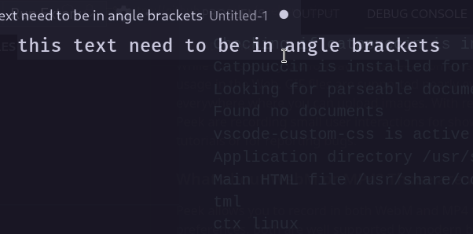

# Angle Wrapper README

Simple extension to wrap text in angle brackets.

## Features

Wrap text in angle brackets pressing "<" on selection



## Extension Settings

```json

"keybindings": [
			{
				"command": "angle-wrapper.wrap",
				"key": "<",
				"when": "editorFocus && editorHasSelection"
			}
		]

```

# Release Notes

See [CHANGELOG.md](https://github.com/cofeek-codes/angle-wrapper.vscode/blob/main/CHANGELOG.md)
